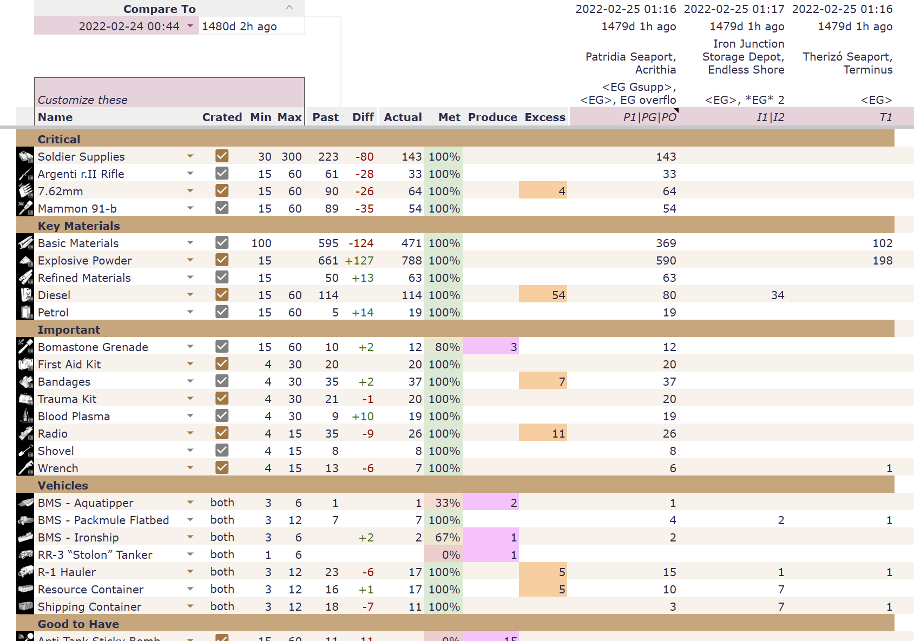

# Foxhole Inventory Report (fir)

fir is known for accurate recognition of [Foxhole](https://www.foxholegame.com/about-foxhole) stockpile information.

Given a map-view screenshot of any stockpile, the following are extracted:
* Structure name (i.e. Seaport, Bunker Base, etc.)
* Stockpile name (for private stockpiles)
* Structure technology (i.e. bunker garrison upgrade status)
* Stockpile contents (each item and quantity)
* Pixel boundary information for each of the above (i.e. if you want to display or highlight part of the image)

All common (and most other) icon mods are supported.

The goal is 100% accuracy, so please share any problematic screenshots via Discord or GitHub!

## General Usage

### Website

At https://fir.gicode.net/, stockpile screenshots can be compiled into visual reports and exported to machine-readable formats.

### Spreadsheets

The website can be used to process screenshots and append to a Google Spreadsheet.

* [Create New Spreadsheet from Template](https://docs.google.com/spreadsheets/d/1hoAZIjBNFf8JW3XHvChwYpt-szgbi4XByvbncbZnj-8/copy)
* [View Demo Spreadsheet](https://docs.google.com/spreadsheets/d/1_TQFog_pDrwGmH4so63c8IW7sm7hlMl0kBs3WtM6CiE/edit?gid=1920645043)



Multiple alternate spreadsheets exist.


## Developer Integrations

### Browser or Node.js (via WebAssembly)

See `includes/debug.js` for a relatively succinct example.

### API

Runs on at least Windows and Linux.

```shell
$ ./fic http-server 127.0.0.1:8000
Listening on http://127.0.0.1:8000
127.0.0.1:54422 POST /extract 200 61.317955ms
127.0.0.1:50236 POST /extract 200 56.144978ms
127.0.0.1:50252 POST /extract 200 54.504678ms
```

```shell
$ curl -v --data-binary @<image-file> http://localhost:8000/extract
{ ...stockpile-json... }
```

### Command Line

Runs on at least Windows and Linux.

```shell
$ ./fic extract <image-file>...
[{ ...stockpile-json... }]
```

## Building (companion)

The companion is a single executable file that can be run without any other dependencies.

```shell
cd native
cargo build --release --bin fic
target/release/fic http-server 0.0.0.0:8000
```

If you'd like to run it in Docker, here are some example commands.

```shell
podman build -f Dockerfile.companion -t fir_companion .
podman run -it --rm --init -p 8000:8000 fir_companion http-server 0.0.0.0:8000
```

## Hosting (website)
The static files in the repo are all you need, so you can host with any webserver you like.  Some examples are below.

### Local
```shell
cd fir
python3 -m http.server
```
### Docker
To build the docker container run:
```shell
docker build -f Dockerfile.server --tag 'fir_server' .
```

If you'd like to override the override the port the server listens on run:
```shell
docker build -f Dockerfile.server --build-arg PORT=<override port> --tag 'fir_server' .
```

To run the fir server in the built docker continer:
```shell
docker run -p <host port>:<fir port> fir_server
```
The `-p` argument maps the host port to the fir server port inside the container. fir defaults to listening on port
8000.

## Sidebar
The project also includes a Google Script spreadsheet sidebar, as an alternative way to import Stockpile data into a spreadsheet.
Find details in the [/gs-sidebar/readme.md](gs-sidebar/readme.md)

## Development

Standalone website:
```shell
cd fir
python3 -m http.server
```

To build the google spreadsheet sidebar, run `./sundial/gs-build.sh` and find the files to be added to Google Apps Script in `./sundial/gs-build`.

### Training

The training process is somewhat complex.  If you are interested in running the training, please reach out on Discord for more information.

#### Standalone

The standalone method will require you to manually install all the necessary dependencies, such as Node, NPM, TensorFlow, etc.
To begin training, simply run `build.sh <FModel-Data-Directory>`.

#### Docker

Training can also be performed using a Docker container instead. [https://docs.docker.com/desktop/features/wsl/]
If you plan to use your GPU(s) for training, you will need to install NVIDIA drivers and the NVIDIA Container Toolkit. [https://docs.nvidia.com/ai-enterprise/deployment/vmware/latest/docker.html]

Build the docker container by running docker `docker build -f Dockerfile.trainer --tag 'fir_trainer' .`

If you only want to utilize your CPU for training, run `docker run -it --rm -v $PWD:/tmp -w /tmp -e WAR_LOCATION=<FModel-Data-Directory> fir_trainer`

If you want to utilize both your CPU and GPU(s) for training, run `docker run --gpus all -it --rm -v $PWD:/tmp -w /tmp -e WAR_LOCATION=<FModel-Data-Directory> fir_trainer`

## License

All original source code and contributions available under MIT License.

Catalog details and icons processed from the game Foxhole (created by [Siege Camp](https://www.siegecamp.com/)) are made available only under Fair Use.
